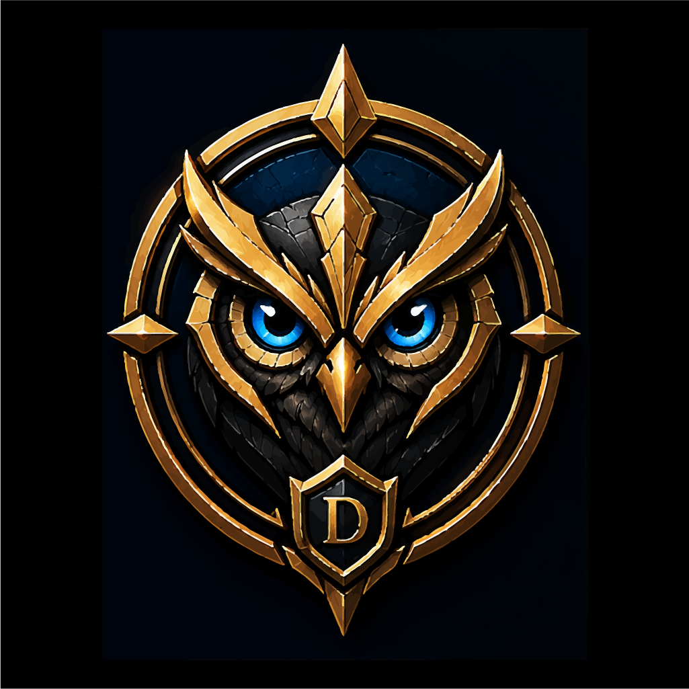
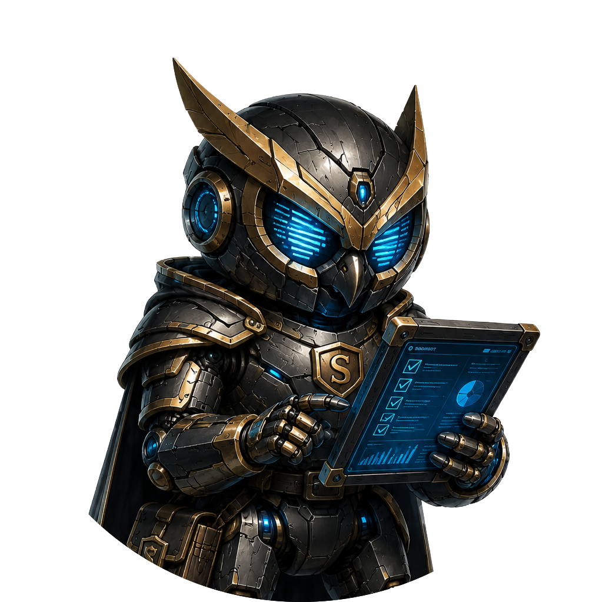
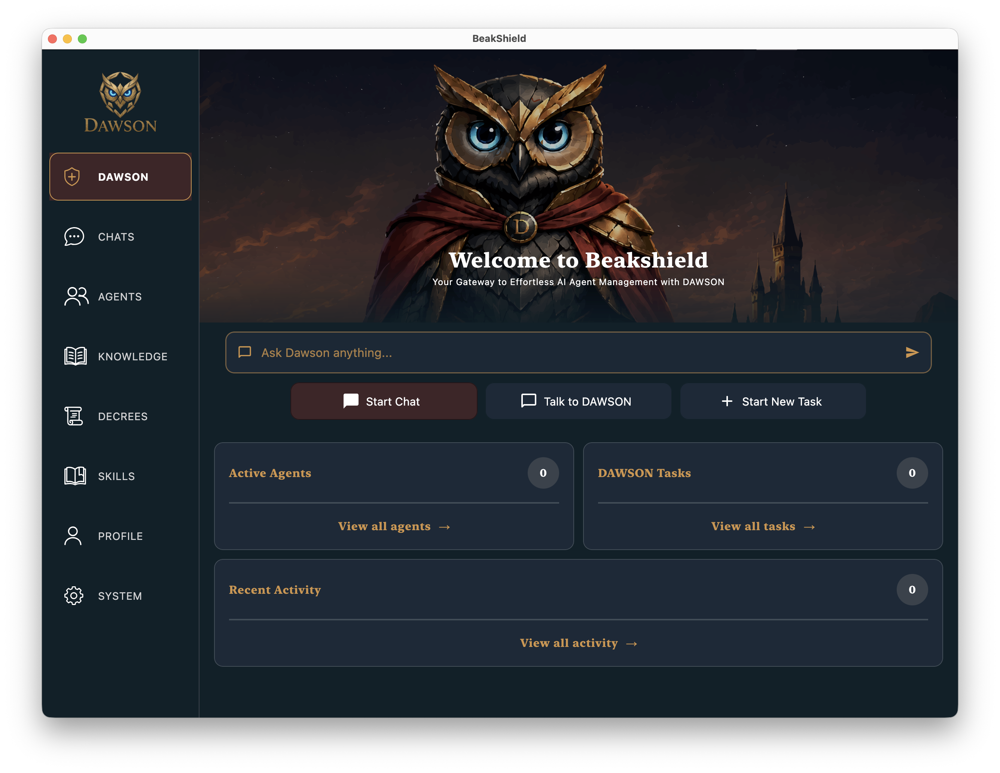

  

# DAWSON
### Digital Assistant Working Safely Offline\*

*A self-hosted AI orchestration platform focused on peristant and controllable knowledge, agent collaboration, and safe local automation.*

---

## What is DAWSON?

DAWSON is a self-hosted, open-source agent harness, developed with the goal of being self-contained, portable, safe, and usable on macOS, Windows, Linux systems.

The objective isn't to reinvent the wheel, but rather to introduce new ways of interacting with your system, data, and favorite local and frontier models.

DAWSON is designed to be a simple but useful system that provides configurable host access throughout conversations, opens up the memory "black box", and gives both users and contributors a clean companion application (<a href="https://github.com/OBrown101/beakshield">Beakshield</a>) to work with.

 

---

# Background

While the name is a slight misnomer, the original acronym and goal for this system (in March 2023) was just that: an offline assistant.

I was new to AI and Python then, so DAWSON became a learning playground for both: TTS/STT engines, intent classification, training models, integrating tool calls. It could hear a wake‑word, process basic text/voice prompts, and run simple tools—more of a parlor trick but it was a start.

With the rapid emergence of readily available LLMs, agent harnesses, etc, I decided to pick up the project again and take it to the next level.

While many of DAWSON's individual features exist in other agent harnesses, several aspects are relatively uncommon in combination: built-in MemPalace (https://github.com/mempalace/mempalace/) integration, a single persistent orchestrator (Dawson), per-user AI ecosystems, a dedicated cross-platform companion application, and a fully open-source architecture.

This project is a work-in-progress, though the primary agent handling, tools, skills, and memory foundations have been laid and work well. Well enough, in fact, for me to utilize it daily in my own contract engineering work. Many features are still under active development and are outlined throughout the remainder of this document. With further develoment and hard work, I foresee DAWSON becoming a valuable tool for engineers and average users alike.

>**Note:**
> Though AI chatbots (ChatGPT, etc.) were used as development tools, this is **NOT** a **VIBE CODED** project.
> Only one agent harness was employed for code generation—just a dozen or so lines that I later rewrote myself.
> (Of course, this doesn't include DAWSON writing his own harness code, which is the natural evolution of these projects.)

---

# Design Goals

Rather than listing features, this section describes the ideas that drive the project.

Each item is marked with its current implementation status.

---

## 🦉 A Persistent Orchestrator *[In-Progress]*

At the center of every DAWSON installation is **Dawson** himself.

Unlike chat-specific agents, Dawson is intended to be a persistent orchestrator responsible for coordinating specialized agents, maintaining awareness of the overall system, and eventually handling long-running tasks such as project management, email monitoring, and automation.

While Squirebots (regular chat agents) are robotic and direct in their nature, Dawson is designed to be more conversational, helping refine ideas, coordinate work, and oversee the kingdom as a whole.

 

---

## ⚔ Dedicated Chats/Agents *[Working]*

Each conversation creates its own dedicated **Squirebot**.

Squirebots are intentionally direct and task-focused. Their job is to answer questions, complete work, and contribute useful knowledge back to the shared palace.

 

---

## 📚 Shared Knowledge *[Working]*

DAWSON integrates **MemPalace** directly into the platform rather than needing a separate MCP setup.

Every agent has access to the same persistent knowledge base, allowing lessons learned during one project to naturally benefit future work.

Instead of isolated chat histories, the kingdom continuously builds a shared body of knowledge.

---

## 🔍 Knowledge You Can Actually See *[Planned]*

Many AI systems store memories behind the scenes with little visibility into what has actually been remembered.

Beakshield is designed to expose that knowledge.

Users will be able to browse, search, inspect, and remove individual memories stored within MemPalace, keeping the system transparent and ensuring long-term knowledge remains accurate.

---

## 🛠 Claude Skills *[Working]*

DAWSON adopts Anthropic's **Claude Skills** format for compatibility and reusable expertise.

Rather than embedding large amounts of specialized knowledge into every prompt, Skills allow expertise to be authored once and reused throughout the system.

---

## 📜 Royal Decrees *[Planned]*

Some guidance shouldn't live inside prompts.

Royal Decrees are intended to become permanent rules that shape how the kingdom behaves.

Examples include coding standards, writing preferences, workflow policies, or communication guidelines.

Unlike Skills, Decrees focus on how agents should style their work rather than how to actually perform it.

---

## 👤 Personalized Service *[Planned]*

As master of the kingdom, your workers serve you best when they actually know something about you.

DAWSON will maintain an evolving profile called **"What DAWSON Knows About You."**

Unlike hidden personalization systems, these notes remain completely visible and editable by the user.

---

## 🛡 Flexible Security *[Working]*

Not every task requires unrestricted access to your computer—and the level of access required can change throughout a conversation.

Every chat operates under configurable permission modes and directory workspaces. Modes range from **Egg** for conversational assistance to **Ultimate** for advanced autonomous workflows, and can be changed at any point during a conversation.

Utilizing directory whitelists, approval workflows, and permission-aware tools help ensure agents only access what you explicitly allow.

---

## 🖥 Beakshield Companion Application *[In Active Development]*

While DAWSON itself is intentionally server-focused, the primary user experience is provided by **Beakshield**, a cross-platform application built with Kotlin Multiplatform.

Rather than exposing users to terminals and configuration files, Beakshield presents DAWSON through a clean desktop interface focused on productivity.

Current working features include:

- Squirebot chat interface and security configuration
- Secure DAWSON connectivity
- Provider management
- Server/system configuration

Future updates will introduce:

- DAWSON home dashboard
- Agent hierarchy visualization
- Knowledge browser
- Royal Decree management
- Skills library
- User profiles
- Live agent monitoring

  

---

# Current Focus

The current focus of development is building a solid foundation.

Rather than implementing dozens of experimental features, the priority has been to establish reliable agent execution, memory integration, secure communication, and a polished desktop experience through Beakshield.

With those foundations in place, future development will focus on expanding DAWSON's orchestration capabilities, integrations, and available tools.

---

# Current Project Status

## ✅ Working

- Multi-agent architecture
- Dedicated chat agents (Squirebots)
- Shared MemPalace integration
- Claude Skills integration
- Permission-aware security modes
- OpenAI support
- Anthropic support
- Ollama support
- Secure WebSocket communication
- Persistent chat storage
- Cross-platform Beakshield foundation (desktop currently)

---

## 🚧 In Progress

- Persistent DAWSON orchestrator
- Beakshield dashboard
- Available tools expansion

---

## 📅 Planned

- User profiles
- Knowledge browser
- Long-running background tasks
- Live activity monitoring
- Royal Decrees
- Page (sub-agent) orchestration
- Voice interaction
- Expanded automation workflows

---

# Philosophy

There are already excellent AI chat applications.

There are already excellent coding agents.

There are already excellent terminal harnesses.

DAWSON isn't trying to replace them.

Instead, the goal is to build a cohesive ecosystem that is intuitive for users while remaining approachable for engineers who want to contribute, extend, and experiment with the platform.